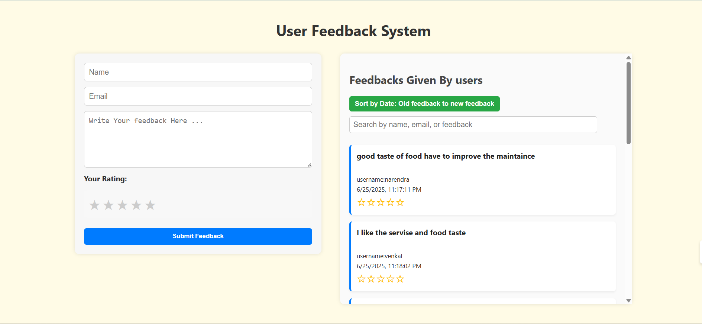

# 📝 User Feedback System

A full-stack user feedback application using **React** for the frontend and **Node.js**, **Express**, and **MongoDB (Mongoose)** for the backend. Users can submit feedback and view it in a dashboard with filtering and sorting features.

---

## 📁 Project Structure

```
user-feedback-system/
├── src/
│   ├── app.js           # Frontend main React component
│   └── backend/         # Backend code (Node.js + Express + Mongoose)
│       ├── server.js    # Entry point for the backend server
│       ├── Databaseschema.ja
│       │                # Mongoose model for feedback
│       └── routes.js/
│                      # Routes handling /feedback endpoint
├── package.json         # Root dependencies (if monorepo style)
├── README.md            # Project documentation
```

---

## 📦 Required Packages

### Backend (`src/backend/`):
- `express`
- `dotenv`
- `mongoose`
- `cors`
- `body-parser` *(optional)*

### Frontend (`src/app.js`):
- `react`
- `axios`
- `react-router-dom` *(if routing used)*

---

## 🔁 Application Workflow

1. Users access the React frontend (`src/app.js`).
2. They fill a form with:
   - Name
   - Email
   - Feedback text
3. On submit:
   - A **POST** request is made to `/feedback`.
   - The backend stores the feedback in **MongoDB**.
4. The dashboard fetches all feedback using **GET** `/feedback` and allows:
   - **Search** (e.g., by name,email or feedback)
   - **Sort** by submission timestamp

---

## 🖼️ Screenshots

### 🧾 Feedback Form


---

## 🚀 Getting Started

### 📥 Clone the Repository

```bash
git clone https://github.com/your-username/user-feedback-system.git
cd user-feedback-system
```

### 🖥️ Backend Setup

1. Navigate to the backend folder:

```bash
cd src/backend
```

2. Install backend dependencies:

```bash
npm install
```

3. Create a `.env` file:

```
PORT=5000
MONGODB_URI=your_mongodb_connection_string
```

4. Start the backend server:

```bash
node server.js
```

### 🌐 Frontend Setup

1. Navigate back to project root and install dependencies (if monorepo):

```bash
npm install
```

2. Start the frontend React app:

```bash
npm start
```

The frontend runs at `http://localhost:3000` and the backend at `http://localhost:5000`.

---

## 📡 API Endpoints

| Method | Endpoint     | Description               |
|--------|--------------|---------------------------|
| POST   | `/feedback`  | Submit user feedback      |
| GET    | `/feedback`  | Retrieve all feedback     |

---

## 📋 Feedback Data Structure

```json
{
  "username": "John Doe",
  "email": "john@example.com",
  "feedbackText": "Great app!",
  "timestamp": "2025-06-26T12:34:56Z"
}
```

---

## 🙋 How to Contribute or Run Locally

1. Fork and clone the repo.
2. Follow the backend and frontend setup.
3. Open in your favorite code editor.
4. Happy coding!

---

## 🧾 License

This project is licensed under the MIT License.
